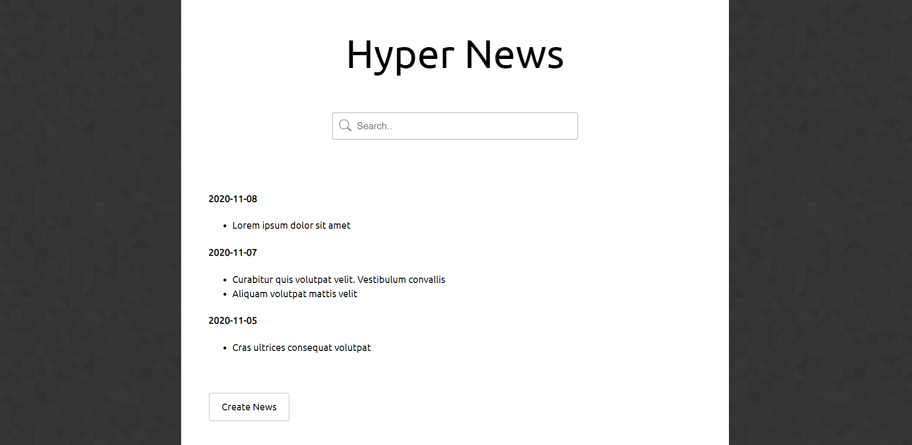
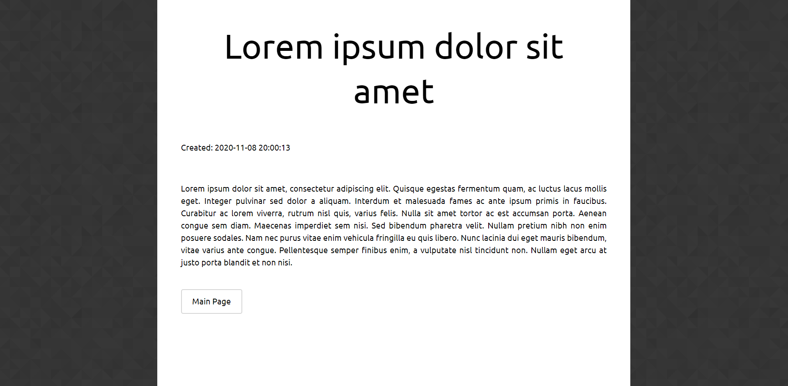
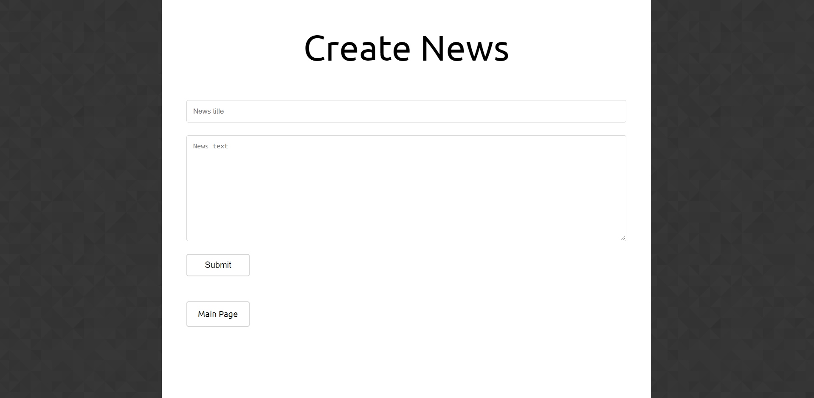

# Project Name
HyperNews-Portal

## Table of contents
* [General info](#general-info)
* [Screenshots](#screenshots)
* [Technologies](#technologies)
* [Features](#features)
* [Status](#status)

## General info
The times of sitting down with a coffee and reading a newspaper seem to have passed. Now everyone gets news from their laptops or phones, so online news websites are very popular. These sites specialize on the collecting and sharing general news or materials on some specific topic. In this project I create a news page with the help of django.

## Screenshots

## Technologies
* python - version 3.8
* django - version 2.2

## Features
List of features
* view news
* add news
* search news

## Status
Project is: _finished_
